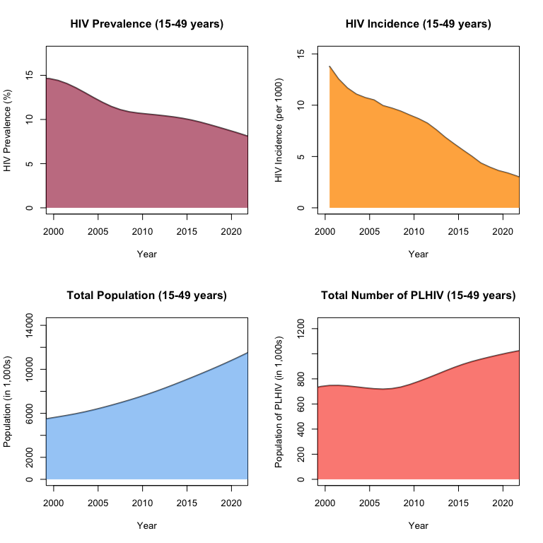

<!-- README.md is generated from README.Rmd.
Please edit that file and run `knitr::knit("README.Rmd") from the root of this directory` -->

# first90

[](https://travis-ci.com/mrc-ide/first90release)

UNAIDS put forward the ambitious 90-90-90 target to end the AIDS
epidemic by 2030. This target aims for 90% of people living with HIV
(PLHIV) to be aware of their HIV-positive status, 90% of those diagnosed
to receive antiretroviral therapy, and 90% of those on treatment to have
a suppressed viral load by 2020 (each reaching 95% by 2030). HIV testing
remains an important bottleneck in this cascade, however, and obtaining
reliable epidemiological data on the proportion of PLHIV aware of their
status is difficult. Such information is nevertheless crucial to
effectively monitor HIV prevention efforts. Tracking progress towards
achievement of this “first 90” target could be improved by combining
population-based surveys and programmatic data on the number of HIV
tests performed (and yield) in a coherent deterministic/statistical
model. This type of integrative systems modelling is especially useful
to fully consider HIV incidence, mortality, testing behaviours, as well
as to coherently combine different sources of data.

The goal of the first90 package is to provide annual estimates of the
proportion of PLHIV that are aware of their status, by combining
estimates of PLHIV from EPP/Spectrum, annual programmatic data on the
number of HIV tests performed (and yield), and nationally-representative
survey of HIV testing behaviors.

## Installation

Install via Github using `devtools`:

``` r
devtools::install_github("mrc-ide/first90release")
```

## Example: Malawi

This example demonstrates basic model steps.

``` r
# Read PJNZ file(s)
pjnz <- "~/Downloads/Malawi_2018_version_8.PJNZ"
cnt <- first90::read_country(pjnz)

fp <- first90::prepare_inputs(pjnz)
# first90::prepare_inputs can also take a list of files, if using regional files
# e.g. fp <- first90::prepare_inputs(list.files("~/Documents/Data/", "CotedIvoire.*PJNZ$", full.names=TRUE, ignore.case=TRUE))
fp$popadjust <- FALSE

# We visualize the PJNZ data
first90::plot_pjnz(fp)
```

<!-- -->

The following functions enable users to produce invidual plots.

    pjnz_summary <- first90::get_pjnz_summary_data(fp)
    first90::plot_pjnz_pop(pjnz_summary)
    first90::plot_pjnz_plhiv(pjnz_summary)
    first90::plot_pjnz_prv(pjnz_summary)
    first90::plot_pjnz_inc(pjnz_summary)

``` r
age_group <- c('15-24','25-34','35-49')
# Import and prepare your survey data. See [guidance](SurveyDataGuidance.md)
survey_hts <- data.frame(country="Malawi",
                                  surveyid="Survey1",
                                  year=2000,
                                  agegr="15-99",
                                  sex="both",
                                  outcome="evertest",
                                  hivstatus="positive",
                                  est=0.553,
                                  se=0.0159,
                                  ci_l=2.5652e-12,
                                  ci_u=8958e-12,
                                  counts=16168)

dat <- first90::select_hts(survey_hts, cnt, age_group)

# Import and prepare your programmatic data. See [guidance](ProgramDataGuidance.md)
prgm_dat <- data.frame(country = "Malawi",
                       year = 2010,
                       sex = 'both',
                       agegr = "15-99",
                       tot = 215269,
                       totpos = 50115,
                       vct = 107634,
                       vctpos = 25057,
                       anc = 107635,
                       ancpos = 25058)
prg_dat <- first90::select_prgmdata(prgm_dat, cnt, age_group)

# We visualize the program data
first90::plot_inputdata(prg_dat, fp)
```

<!-- -->

The following functions enable users to produce invidual plots.

    first90::plot_input_tot(prgm_dat, fp)
    first90::plot_input_totpos(prgm_dat, fp)
    first90::plot_input_anctot(prgm_dat, fp)
    first90::plot_input_ancpos(prgm_dat, fp)

``` r
# ---- Enter parameters here ----
# We create the likelihood data
likdat <- first90::prepare_hts_likdat(dat, prg_dat, fp)

# Starting parameters
data("theta0", package="first90")
first90::ll_hts(theta0, fp, likdat)
#> [1] -537.5141

opt <- optim(theta0, ll_hts, fp = fp, likdat = likdat, method = "BFGS", 
             control = list(fnscale = -1, trace = 4, REPORT = 1, maxit = 250), hessian = TRUE)
#> initial  value 537.514135 
#> iter   2 value 225.403355
#> iter   3 value 197.950605
#> iter   4 value 165.579953
#> iter   5 value 145.454905
#> iter   6 value 128.346255
#> iter   7 value 111.494032
#> iter   8 value 95.202033
#> iter   9 value 79.210668
#> iter  10 value 68.875906
#> iter  11 value 62.954741
#> iter  12 value 54.275624
#> iter  13 value 47.287029
#> iter  14 value 42.366994
#> iter  15 value 39.518052
#> iter  16 value 35.799708
#> iter  17 value 34.644478
#> iter  18 value 33.809043
#> iter  19 value 33.219866
#> iter  20 value 31.156984
#> iter  21 value 30.520792
#> iter  22 value 28.957640
#> iter  23 value 28.621258
#> iter  24 value 28.240368
#> iter  25 value 27.913753
#> iter  26 value 27.533294
#> iter  27 value 27.059544
#> iter  28 value 26.579216
#> iter  29 value 26.479967
#> iter  30 value 25.877987
#> iter  31 value 25.406857
#> iter  32 value 25.165369
#> iter  33 value 25.065890
#> iter  34 value 25.031020
#> iter  35 value 24.701009
#> iter  36 value 24.298628
#> iter  37 value 24.009337
#> iter  38 value 23.886433
#> iter  39 value 23.464852
#> iter  40 value 23.167976
#> iter  41 value 23.094387
#> iter  42 value 22.716660
#> iter  43 value 22.665284
#> iter  44 value 22.440609
#> iter  45 value 21.562546
#> iter  46 value 20.846583
#> iter  47 value 19.998687
#> iter  48 value 19.969511
#> iter  49 value 19.269384
#> iter  50 value 18.944166
#> iter  51 value 17.996559
#> iter  52 value 17.089936
#> iter  53 value 16.180640
#> iter  54 value 15.990390
#> iter  55 value 15.863024
#> iter  56 value 15.806579
#> iter  57 value 15.660232
#> iter  58 value 14.976849
#> iter  59 value 14.801829
#> iter  60 value 14.631621
#> iter  61 value 14.524722
#> iter  62 value 14.502729
#> iter  63 value 14.465752
#> iter  64 value 14.363280
#> iter  65 value 14.301438
#> iter  66 value 14.179658
#> iter  67 value 14.169216
#> iter  68 value 14.164491
#> iter  69 value 14.146303
#> iter  70 value 14.143437
#> iter  71 value 14.138722
#> iter  72 value 14.138266
#> iter  73 value 14.137414
#> iter  74 value 14.137281
#> iter  75 value 14.137204
#> iter  76 value 14.136923
#> iter  77 value 14.136073
#> iter  78 value 14.135064
#> iter  79 value 14.134614
#> iter  80 value 14.133262
#> iter  81 value 14.131301
#> iter  82 value 14.129535
#> iter  83 value 14.125115
#> iter  84 value 14.122768
#> iter  85 value 14.119140
#> iter  86 value 14.116008
#> iter  87 value 14.111339
#> iter  88 value 14.106948
#> iter  89 value 14.105951
#> iter  90 value 14.100838
#> iter  91 value 14.094597
#> iter  92 value 14.094149
#> iter  93 value 14.092650
#> iter  94 value 14.092023
#> iter  95 value 14.091302
#> iter  96 value 14.090756
#> iter  97 value 14.089687
#> iter  98 value 14.088408
#> iter  99 value 14.087422
#> iter 100 value 14.087391
#> iter 101 value 14.081511
#> iter 102 value 14.080634
#> iter 103 value 14.080198
#> iter 104 value 14.080116
#> iter 105 value 14.080062
#> iter 106 value 14.079788
#> iter 107 value 14.077864
#> iter 108 value 14.077237
#> iter 109 value 14.074794
#> iter 110 value 14.074198
#> iter 111 value 14.073334
#> iter 112 value 14.072913
#> iter 113 value 14.072340
#> iter 114 value 14.071787
#> iter 115 value 14.071607
#> iter 116 value 14.071456
#> iter 117 value 14.071284
#> iter 118 value 14.070894
#> iter 119 value 14.070825
#> iter 120 value 14.070791
#> iter 121 value 14.070716
#> iter 122 value 14.070582
#> iter 123 value 14.070325
#> iter 124 value 14.070142
#> iter 125 value 14.069919
#> iter 126 value 14.069783
#> iter 127 value 14.069775
#> iter 128 value 14.069729
#> iter 129 value 14.069609
#> iter 130 value 14.069454
#> iter 131 value 14.069273
#> iter 132 value 14.069172
#> iter 133 value 14.069150
#> iter 134 value 14.069133
#> iter 135 value 14.069088
#> iter 136 value 14.068956
#> iter 137 value 14.068752
#> iter 138 value 14.068430
#> iter 139 value 14.068284
#> iter 140 value 14.067399
#> iter 141 value 14.067376
#> iter 142 value 14.067201
#> iter 143 value 14.066982
#> iter 144 value 14.066862
#> iter 145 value 14.066758
#> iter 146 value 14.066732
#> iter 147 value 14.066722
#> iter 147 value 14.066722
#> iter 148 value 14.066488
#> iter 149 value 14.066443
#> iter 150 value 14.066386
#> iter 151 value 14.066378
#> iter 152 value 14.066372
#> iter 152 value 14.066372
#> iter 153 value 14.066371
#> iter 154 value 14.066358
#> iter 154 value 14.066358
#> iter 155 value 14.066307
#> iter 155 value 14.066307
#> iter 155 value 14.066307
#> final  value 14.066307 
#> converged

simul <- first90::simul.test(opt, fp, sim = 400)

# ---- Plots for FITS ----
fp <- first90::create_hts_param(opt$par, fp)
mod <- first90::simmod(fp)

# ---- The Fitted Parameters ----
first90::optimized_par(opt)
#> Loading required package: Matrix
#>                               Parameter_Name Estimate  LCI  UCI
#> 1                    RR testing: men in 2005     0.80 0.67 0.90
#> 2                    RR testing: men in 2012     0.83 0.73 0.91
#> 3                         RR re-testing 2010     2.11 1.32 3.85
#> 4                         RR re-testing 2015     2.11 1.29 3.99
#> 5                  RR testing: PLHIV unaware     1.45 1.21 1.64
#> 6  RR re-testing: PLHIV aware (not ART) 2010     1.35 0.10 6.20
#> 7  RR re-testing: PLHIV aware (not ART) 2021     1.38 0.13 5.78
#> 8  RR re-testing: PLHIV on ART (*RR not ART)     0.23 0.01 0.88
#> 9                         RR among 25-34 men     1.56 1.33 1.81
#> 10                          RR among 35+ men     2.44 0.43 5.28
#> 11                      RR among 25-34 women     1.66 1.46 1.86
#> 12                        RR among 35+ women     2.56 0.38 5.48
#> 13                        RR OI Dx (ART Cov)     1.20 1.00 1.30

# ---- Functions for individuals model fits ----
out_evertest <- first90::get_out_evertest(mod, fp)

first90::plot_out(mod, fp, likdat, cnt, survey_hts, out_evertest, simul)
```

<!-- -->

The model fits by age and sex.

``` r
first90::plot_out_strat(mod, fp, likdat, cnt, survey_hts, out_evertest, simul)
```

<!-- --> The following
functions enable users to produce invidual plots.

    first90::plot_out_nbtest(mod, fp, likdat, cnt, simul)
    first90::plot_out_nbpostest(mod, fp, likdat, cnt, simul)
    first90::plot_out_evertestneg(mod, fp, likdat, cnt, survey_hts, out_evertest, simul)
    first90::plot_out_evertestpos(mod, fp, likdat, cnt, survey_hts, out_evertest, simul)
    first90::plot_out_evertest(mod, fp, likdat, cnt, survey_hts, out_evertest, simul)
    first90::plot_out_90s(mod, fp, likdat, cnt, out_evertest, survey_hts, simul)
    first90::plot_out_evertest_fbyage(mod, fp, likdat, cnt, survey_hts, out_evertest, simul)
    first90::plot_out_evertest_mbyage(mod, fp, likdat, cnt, survey_hts, out_evertest, simul)

We can compare HIV tests’ positivity through time, the estimated *true*
yield of new HIV diagnoses, and compare those to population-level HIV
prevalence.

``` r
par(mfrow = c(1,1))
first90::plot_prv_pos_yld(mod, fp, likdat, cnt, yr_pred = 2018)
```

<!-- -->

We can also examine some ouptuts related to the distribution of HIV
tests performed in those susceptibles to HIV and PLHIV by different
awareness and treatment status. (First sets of graphs is on the absolute
scale, second one on the relative scale.)

``` r
par(mfrow = c(1,2))
first90::plot_retest_test_neg(mod, fp, likdat, cnt)
first90::plot_retest_test_pos(mod, fp, likdat, cnt)
```

<!-- -->

``` r
par(mfrow = c(1,2))
first90::plot_retest_test_neg(mod, fp, likdat, cnt, relative = TRUE)
first90::plot_retest_test_pos(mod, fp, likdat, cnt, relative = TRUE)
```

<!-- -->

Finally, tabular outputs can be obtained by using the following
functions.

``` r
# ---- Tabular outputs ----
first90::tab_out_evertest(mod, fp, simul = simul)
#>    year  outcome agegr  sex hivstatus value lower upper
#> 1  2010 evertest 15-49 both       all  13.5  12.6  15.1
#> 2  2011 evertest 15-49 both       all  14.9  13.9  16.7
#> 3  2012 evertest 15-49 both       all  16.3  14.9  18.9
#> 4  2013 evertest 15-49 both       all  17.5  15.7  21.5
#> 5  2014 evertest 15-49 both       all  18.6  16.4  24.4
#> 6  2015 evertest 15-49 both       all  19.5  16.8  27.1
#> 7  2016 evertest 15-49 both       all  20.5  17.1  29.6
#> 8  2017 evertest 15-49 both       all  21.3  17.4  31.5
#> 9  2018 evertest 15-49 both       all  22.0  17.5  33.7
#> 10 2019 evertest 15-49 both       all  22.6  17.5  36.4
#> 11 2020 evertest 15-49 both       all  23.0  17.3  38.5
#> 12 2021 evertest 15-49 both       all  23.3  16.9  40.4
first90::tab_out_aware(mod, fp, simul = simul)
#>    year outcome agegr  sex hivstatus value lower upper
#> 1  2010   aware 15-49 both  positive  28.3  28.2  31.7
#> 2  2011   aware 15-49 both  positive  34.9  34.9  37.8
#> 3  2012   aware 15-49 both  positive  41.8  41.8  44.5
#> 4  2013   aware 15-49 both  positive  47.9  47.9  50.5
#> 5  2014   aware 15-49 both  positive  53.1  53.1  55.9
#> 6  2015   aware 15-49 both  positive  58.3  58.3  61.3
#> 7  2016   aware 15-49 both  positive  64.0  64.0  66.7
#> 8  2017   aware 15-49 both  positive  69.3  69.3  71.6
#> 9  2018   aware 15-49 both  positive  73.7  73.7  76.1
#> 10 2019   aware 15-49 both  positive  77.4  77.4  79.8
#> 11 2020   aware 15-49 both  positive  80.0  79.9  82.4
#> 12 2021   aware 15-49 both  positive  81.3  81.1  83.9
first90::tab_out_nbaware(mod, fp)
#>    year      outcome agegr  sex hivstatus  value
#> 1  2010 number aware 15-49 both  positive 198924
#> 2  2011 number aware 15-49 both  positive 252007
#> 3  2012 number aware 15-49 both  positive 310329
#> 4  2013 number aware 15-49 both  positive 363967
#> 5  2014 number aware 15-49 both  positive 411324
#> 6  2015 number aware 15-49 both  positive 458015
#> 7  2016 number aware 15-49 both  positive 507482
#> 8  2017 number aware 15-49 both  positive 552065
#> 9  2018 number aware 15-49 both  positive 589397
#> 10 2019 number aware 15-49 both  positive 619931
#> 11 2020 number aware 15-49 both  positive 639431
#> 12 2021 number aware 15-49 both  positive 646686
first90::tab_out_artcov(mod, fp)
#>    year outcome agegr  sex hivstatus value
#> 1  2010  artcov   15+ both  positive  30.2
#> 2  2011  artcov   15+ both  positive  37.6
#> 3  2012  artcov   15+ both  positive  45.6
#> 4  2013  artcov   15+ both  positive  51.4
#> 5  2014  artcov   15+ both  positive  56.9
#> 6  2015  artcov   15+ both  positive  61.1
#> 7  2016  artcov   15+ both  positive  68.1
#> 8  2017  artcov   15+ both  positive  72.6
#> 9  2018  artcov   15+ both  positive  77.2
#> 10 2019  artcov   15+ both  positive  80.8
#> 11 2020  artcov   15+ both  positive  83.2
#> 12 2021  artcov   15+ both  positive  84.3
```

## Running tests

Some tests require sample files. If you have access, Spectrum files are
available on SharePoint
[here](https://imperiallondon-my.sharepoint.com/:f:/r/personal/epidem_ic_ac_uk/Documents/UNAIDS%20Ref%20Group%20Shared%20Drive/Ref%20Group%20Meetings/Meetings%202018/first%2090%20workshop%20-%20Wisbech%20August%202018?csf=1&e=MFospr)
To use them, create a directory with `mkdir tests/testhat/sample_files`
and copy the Malawi .PJNZ file into it.

Or if you access to the private repo, you can clone it:

    git clone https://github.com/mrc-ide/shiny90_sample_files tests/testthat/sample_files

Then run `r devtools::test()`
