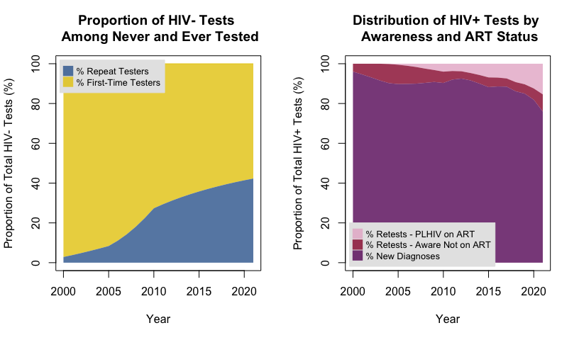

<!-- README.md is generated from README.Rmd.
Please edit that file and run `knitr::knit("README.Rmd") from the root of this directory` -->
first90
=======

[](https://travis-ci.com/mrc-ide/first90release)

UNAIDS put forward the ambitious 90-90-90 target to end the AIDS epidemic by 2030. This target aims for 90% of people living with HIV (PLHIV) to be aware of their HIV-positive status, 90% of those diagnosed to receive antiretroviral therapy, and 90% of those on treatment to have a suppressed viral load by 2020 (each reaching 95% by 2030). HIV testing remains an important bottleneck in this cascade, however, and obtaining reliable epidemiological data on the proportion of PLHIV aware of their status is difficult. Such information is nevertheless crucial to effectively monitor HIV prevention efforts. Tracking progress towards achievement of this “first 90” target could be improved by combining population-based surveys and programmatic data on the number of HIV tests performed (and yield) in a coherent deterministic/statistical model. This type of integrative systems modelling is especially useful to fully consider HIV incidence, mortality, testing behaviours, as well as to coherently combine different sources of data.

The goal of the first90 package is to provide annual estimates of the proportion of PLHIV that are aware of their status, by combining estimates of PLHIV from EPP/Spectrum, annual programmatic data on the number of HIV tests performed (and yield), and nationally-representative survey of HIV testing behaviors.

Installation
------------

Install via Github using `devtools`:

``` r
devtools::install_github("mrc-ide/first90release")
```

Example: Malawi
---------------

This example demonstrates basic model steps.

``` r
# Read PJNZ file(s)
pjnz <- "~/Downloads/Malawi_2018_version_8.PJNZ"
cnt <- first90::read_country(pjnz)

fp <- first90::prepare_inputs(pjnz)
# first90::prepare_inputs can also take a list of files, if using regional files
# e.g. fp <- first90::prepare_inputs(list.files("~/Documents/Data/", "CotedIvoire.*PJNZ$", full.names=TRUE, ignore.case=TRUE))
fp$popadjust <- FALSE

# We visualize the PJNZ data
first90::plot_pjnz(fp)
```


The following functions enable users to produce invidual plots.

    pjnz_summary <- first90::get_pjnz_summary_data(fp)
    first90::plot_pjnz_pop(pjnz_summary)
    first90::plot_pjnz_plhiv(pjnz_summary)
    first90::plot_pjnz_prv(pjnz_summary)
    first90::plot_pjnz_inc(pjnz_summary)

``` r
age_group <- c('15-24','25-34','35-49')
# Import and prepare your survey data. See [guidance](SurveyDataGuidance.md)
survey_hts <- data.frame(country="Malawi",
                                  surveyid="Survey1",
                                  year=2000,
                                  agegr="15-99",
                                  sex="both",
                                  outcome="evertest",
                                  hivstatus="positive",
                                  est=0.553,
                                  se=0.0159,
                                  ci_l=2.5652e-12,
                                  ci_u=8958e-12,
                                  counts=16168)

dat <- first90::select_hts(survey_hts, cnt, age_group)

# Import and prepare your programmatic data. See [guidance](ProgramDataGuidance.md)
prgm_dat <- data.frame(country = "Malawi",
                            year = 2010,
                            sex = 'both',
                            tot = 215269,
                            totpos = 50115,
                            vct = 107634,
                            vctpos = 25057,
                            anc = 107635,
                            ancpos = 25058)
prg_dat <- first90::select_prgmdata(prgm_dat, cnt, age_group)

# We visualize the program data
first90::plot_inputdata(prg_dat, fp)
```


The following functions enable users to produce invidual plots.

    first90::plot_input_tot(prgm_dat, fp)
    first90::plot_input_totpos(prgm_dat, fp)
    first90::plot_input_anctot(prgm_dat, fp)
    first90::plot_input_ancpos(prgm_dat, fp)

``` r
# ---- Enter parameters here ----
# We create the likelihood data
likdat <- first90::prepare_hts_likdat(dat, prg_dat, fp)

# Starting parameters
data("theta0", package="first90")
first90::ll_hts(theta0, fp, likdat)
#> [1] -3427.233

opt <- optim(theta0, ll_hts, fp = fp, likdat = likdat, method = "BFGS", 
             control = list(fnscale = -1, trace = 4, REPORT = 1, maxit = 250), hessian = TRUE)
#> initial  value 3427.232508 
#> iter   2 value 369.945759
#> iter   3 value 222.457279
#> iter   4 value 158.009632
#> iter   5 value 117.799406
#> iter   6 value 102.687225
#> iter   7 value 94.719857
#> iter   8 value 87.048252
#> iter   9 value 77.684113
#> iter  10 value 68.187378
#> iter  11 value 62.329042
#> iter  12 value 60.508361
#> iter  13 value 57.721118
#> iter  14 value 54.631766
#> iter  15 value 53.447347
#> iter  16 value 51.597621
#> iter  17 value 50.119554
#> iter  18 value 48.384023
#> iter  19 value 47.229686
#> iter  20 value 45.934468
#> iter  21 value 44.587330
#> iter  22 value 43.560255
#> iter  23 value 42.702447
#> iter  24 value 42.174042
#> iter  25 value 41.427545
#> iter  26 value 40.476660
#> iter  27 value 40.037037
#> iter  28 value 39.403998
#> iter  29 value 39.059523
#> iter  30 value 38.775756
#> iter  31 value 38.249146
#> iter  32 value 38.131343
#> iter  33 value 38.010536
#> iter  34 value 37.360660
#> iter  35 value 36.950264
#> iter  36 value 36.811929
#> iter  37 value 36.700664
#> iter  38 value 36.536124
#> iter  39 value 36.458675
#> iter  40 value 36.389936
#> iter  41 value 36.344504
#> iter  42 value 36.244944
#> iter  43 value 36.143299
#> iter  44 value 35.820013
#> iter  45 value 35.462645
#> iter  46 value 34.627209
#> iter  47 value 34.273282
#> iter  48 value 33.167439
#> iter  49 value 31.999808
#> iter  50 value 31.357133
#> iter  51 value 30.496347
#> iter  52 value 30.107522
#> iter  53 value 29.338619
#> iter  54 value 28.866870
#> iter  55 value 28.293301
#> iter  56 value 28.010430
#> iter  57 value 27.453825
#> iter  58 value 26.405110
#> iter  59 value 26.021922
#> iter  60 value 25.718035
#> iter  61 value 25.691085
#> iter  62 value 25.620782
#> iter  63 value 25.607961
#> iter  64 value 25.555273
#> iter  65 value 25.547471
#> iter  66 value 25.545472
#> iter  67 value 25.517417
#> iter  68 value 25.506539
#> iter  69 value 25.490988
#> iter  70 value 25.489505
#> iter  71 value 25.477084
#> iter  72 value 25.471116
#> iter  73 value 25.462894
#> iter  74 value 25.455307
#> iter  75 value 25.452654
#> iter  76 value 25.448729
#> iter  77 value 25.447455
#> iter  78 value 25.447015
#> iter  79 value 25.445473
#> iter  80 value 25.445343
#> iter  81 value 25.444019
#> iter  82 value 25.442543
#> iter  83 value 25.441782
#> iter  84 value 25.441665
#> iter  85 value 25.440748
#> iter  86 value 25.439836
#> iter  87 value 25.439417
#> iter  88 value 25.439339
#> iter  89 value 25.439154
#> iter  90 value 25.438856
#> iter  91 value 25.438543
#> iter  92 value 25.438384
#> iter  93 value 25.438247
#> iter  94 value 25.438067
#> iter  95 value 25.438051
#> iter  95 value 25.438051
#> iter  96 value 25.438050
#> iter  97 value 25.437732
#> iter  98 value 25.437346
#> iter  99 value 25.437097
#> iter  99 value 25.437097
#> final  value 25.437097 
#> converged

simul <- first90::simul.test(opt, fp, sim = 400)

# ---- Plots for FITS ----
fp <- first90::create_hts_param(opt$par, fp)
mod <- first90::simmod(fp)

# ---- The Fitted Parameters ----
first90::optimized_par(opt)
#> Loading required package: Matrix
#>                               Parameter_Name Estimate  LCI  UCI
#> 1                    RR testing: men in 2005     0.82 0.63 0.96
#> 2                    RR testing: men in 2012     0.89 0.78 0.97
#> 3                         RR re-testing 2010     1.98 1.65 2.43
#> 4                         RR re-testing 2015     1.98 1.62 2.49
#> 5                  RR testing: PLHIV unaware     1.53 1.48 1.57
#> 6  RR re-testing: PLHIV aware (not ART) 2010     1.06 0.11 4.92
#> 7  RR re-testing: PLHIV aware (not ART) 2017     1.06 0.08 5.53
#> 8  RR re-testing: PLHIV on ART (*RR not ART)     0.14 0.01 0.73
#> 9                         RR among 25-34 men     1.56 1.38 1.75
#> 10                          RR among 35+ men     3.25 2.99 3.52
#> 11                      RR among 25-34 women     2.13 1.95 2.31
#> 12                        RR among 35+ women     3.85 3.58 4.11
#> 13                        RR OI Dx (ART Cov)     1.60 1.50 1.60

# ---- Functions for individuals model fits ----
out_evertest <- first90::get_out_evertest(mod, fp)

first90::plot_out(mod, fp, likdat, cnt, survey_hts, out_evertest, simul)
```


The model fits by age and sex.

``` r
first90::plot_out_strat(mod, fp, likdat, cnt, survey_hts, out_evertest, simul)
```

 The following functions enable users to produce invidual plots.

    first90::plot_out_nbtest(mod, fp, likdat, cnt, simul)
    first90::plot_out_nbpostest(mod, fp, likdat, cnt, simul)
    first90::plot_out_evertestneg(mod, fp, likdat, cnt, survey_hts, out_evertest, simul)
    first90::plot_out_evertestpos(mod, fp, likdat, cnt, survey_hts, out_evertest, simul)
    first90::plot_out_evertest(mod, fp, likdat, cnt, survey_hts, out_evertest, simul)
    first90::plot_out_90s(mod, fp, likdat, cnt, out_evertest, survey_hts, simul)
    first90::plot_out_evertest_fbyage(mod, fp, likdat, cnt, survey_hts, out_evertest, simul)
    first90::plot_out_evertest_mbyage(mod, fp, likdat, cnt, survey_hts, out_evertest, simul)

We can compare HIV tests' positivity through time, the estimated *true* yield of new HIV diagnoses, and compare those to population-level HIV prevalence.

``` r
par(mfrow = c(1,1))
first90::plot_prv_pos_yld(mod, fp, likdat, cnt, yr_pred = 2018)
```


We can also examine some ouptuts related to the distribution of HIV tests performed in those susceptibles to HIV and PLHIV by different awareness and treatment status. (First sets of graphs is on the absolute scale, second one on the relative scale.)

``` r
par(mfrow = c(1,2))
first90::plot_retest_test_neg(mod, fp, likdat, cnt)
first90::plot_retest_test_pos(mod, fp, likdat, cnt)
```


``` r

par(mfrow = c(1,2))
first90::plot_retest_test_neg(mod, fp, likdat, cnt, relative = TRUE)
first90::plot_retest_test_pos(mod, fp, likdat, cnt, relative = TRUE)
```



Finally, tabular outputs can be obtained by using the following functions.

``` r
# ---- Tabular outputs ----
first90::tab_out_evertest(mod, fp, simul = simul)
#>   year  outcome agegr  sex hivstatus value lower upper
#> 1 2010 evertest 15-49 both       all   9.8   8.3  12.5
#> 2 2011 evertest 15-49 both       all  11.5  10.0  14.2
#> 3 2012 evertest 15-49 both       all  13.1  11.3  16.1
#> 4 2013 evertest 15-49 both       all  14.6  12.2  18.4
#> 5 2014 evertest 15-49 both       all  15.8  13.0  21.1
#> 6 2015 evertest 15-49 both       all  16.9  13.5  23.9
#> 7 2016 evertest 15-49 both       all  18.0  14.1  26.4
#> 8 2017 evertest 15-49 both       all  19.0  14.5  28.5
#> 9 2018 evertest 15-49 both       all  19.8  14.8  30.5
first90::tab_out_aware(mod, fp, simul = simul)
#>   year outcome agegr  sex hivstatus value lower upper
#> 1 2010   aware 15-49 both  positive  27.3  27.3  29.2
#> 2 2011   aware 15-49 both  positive  33.9  33.9  34.8
#> 3 2012   aware 15-49 both  positive  40.7  40.7  41.3
#> 4 2013   aware 15-49 both  positive  46.7  46.7  47.5
#> 5 2014   aware 15-49 both  positive  51.8  51.7  53.3
#> 6 2015   aware 15-49 both  positive  56.9  56.8  58.7
#> 7 2016   aware 15-49 both  positive  62.5  62.5  64.1
#> 8 2017   aware 15-49 both  positive  67.7  67.6  69.2
#> 9 2018   aware 15-49 both  positive  72.1  72.0  73.6
first90::tab_out_nbaware(mod, fp)
#>   year      outcome agegr  sex hivstatus  value
#> 1 2010 number aware 15-49 both  positive 196422
#> 2 2011 number aware 15-49 both  positive 250084
#> 3 2012 number aware 15-49 both  positive 307925
#> 4 2013 number aware 15-49 both  positive 361154
#> 5 2014 number aware 15-49 both  positive 408229
#> 6 2015 number aware 15-49 both  positive 454451
#> 7 2016 number aware 15-49 both  positive 503265
#> 8 2017 number aware 15-49 both  positive 547402
#> 9 2018 number aware 15-49 both  positive 584422
first90::tab_out_artcov(mod, fp)
#>   year outcome agegr  sex hivstatus value
#> 1 2010  artcov   15+ both  positive  29.4
#> 2 2011  artcov   15+ both  positive  36.7
#> 3 2012  artcov   15+ both  positive  44.5
#> 4 2013  artcov   15+ both  positive  50.2
#> 5 2014  artcov   15+ both  positive  55.7
#> 6 2015  artcov   15+ both  positive  59.9
#> 7 2016  artcov   15+ both  positive  66.7
#> 8 2017  artcov   15+ both  positive  71.2
#> 9 2018  artcov   15+ both  positive  75.7
```

Running tests
-------------

Some tests require sample files. If you have access, Spectrum files are available on SharePoint [here](https://imperiallondon-my.sharepoint.com/:f:/r/personal/epidem_ic_ac_uk/Documents/UNAIDS%20Ref%20Group%20Shared%20Drive/Ref%20Group%20Meetings/Meetings%202018/first%2090%20workshop%20-%20Wisbech%20August%202018?csf=1&e=MFospr) To use them, create a directory with `mkdir tests/testhat/sample_files` and copy the Malawi .PJNZ file into it.

Or if you access to the private repo, you can clone it:

    git clone https://github.com/mrc-ide/shiny90_sample_files tests/testthat/sample_files

Then run `r devtools::test()`
